# git-work — flujo colaborativo con Git

Repositorio de práctica del flujo colaborativo con Git y GitHub del módulo DPL. La práctica recorre la creación de *issues*, ramas, *pull requests*, revisión, resolución de conflictos, etiquetas y *releases*.

> **Modalidad individual.** GitHub no permite hacer *fork* de un repositorio propio. Por ello, el papel de `user2` se ha simulado con el repositorio espejo `git-work-espejo` y la copia local `AE1-user2`. Las ramas de trabajo se enviaron tanto al espejo como al repositorio principal `AE1` para poder abrir los *pull requests*. En una práctica por parejas, esas ramas habrían llegado desde el *fork* de la segunda persona.

## Índice

- [Entorno e instalación](#entorno-e-instalacion)
- [Configuración](#configuracion)
- [Comprobación](#comprobacion)
- [Problemas encontrados y solución](#problemas-encontrados-y-solucion)
- [Repositorio remoto](#repositorio-remoto)

## Entorno e instalación

El proyecto se ha realizado con dos copias locales: `AE1` (papel de `user1`) y `AE1-user2` (papel de `user2`), además de un repositorio espejo. Para consultar la portada basta con clonar el repositorio y abrir `index.html` en el navegador.

```bash
git clone git@github.com:gabi1447/git-work.git AE1
cd AE1
```

Los remotos usados reflejan la modalidad individual:

```text
origin  → git-work          (repositorio principal, papel de user1)
espejo  → git-work-espejo   (sustituto del fork, papel de user2)
```

### Issue y primera rama: `custom-text`

Se abrió la issue **Add custom text for startup contents** para personalizar la portada.

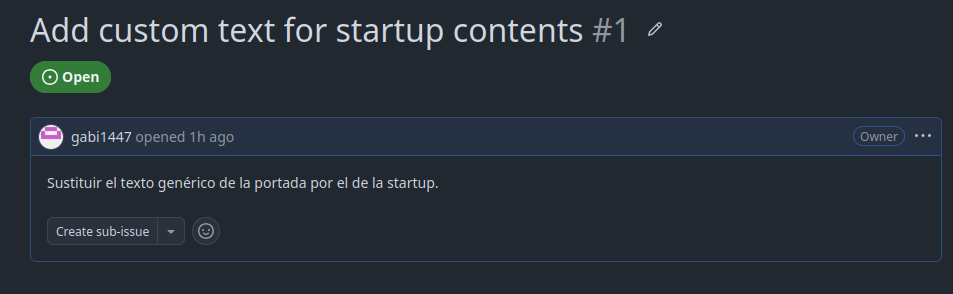

Desde `AE1-user2` se creó la rama `custom-text`, se modificó el contenido de `index.html` y se subió la rama para abrir el PR contra `main` en el repositorio principal.


### Revisión, conversación y fusión del primer PR

La revisión se hizo alternando los dos papeles locales. `user1` incorporó un ajuste en el pie de página y lo envió a la rama del PR; después `user2` afinó el eslogan como respuesta al comentario.


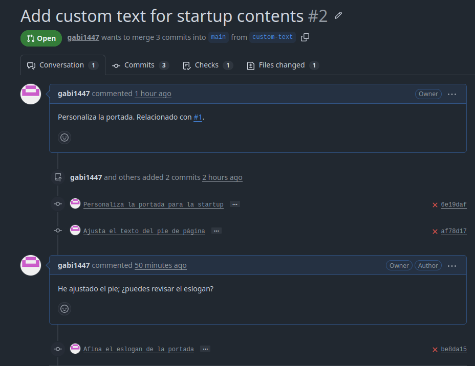

Al realizar la práctica con una única cuenta no fue posible aprobar el propio PR desde GitHub; la plataforma impide la autoaprobación. La revisión quedó evidenciada mediante los comentarios y los commits de ambos papeles, y el PR se fusionó en `main`.


### Segunda issue, conflicto y resolución

Se creó la issue **Improve UX with cool colors** para mejorar el botón principal.

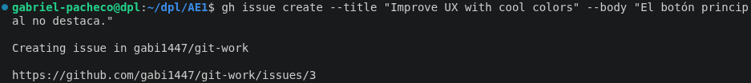

En `main`, `user1` dejó sin publicar un cambio local a `purple`. En paralelo, desde `AE1-user2` se creó `cool-colors` y se cambió la misma línea a `darkgreen`; la rama se envió al espejo y al repositorio principal para poder crear el segundo PR.

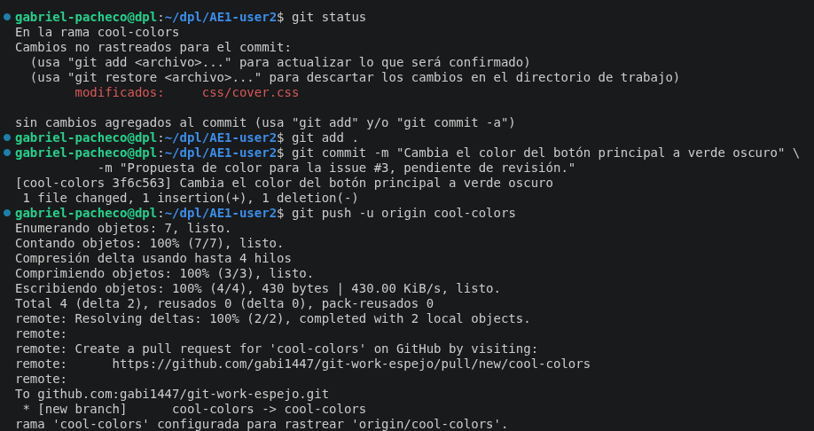

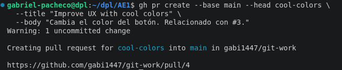

Al traer la rama asociada al PR y fusionarla en el `main` local apareció el conflicto previsto en `css/cover.css`.

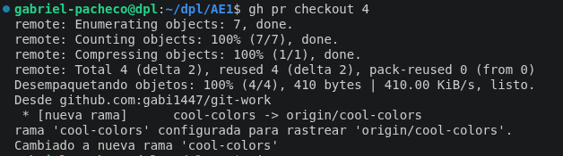

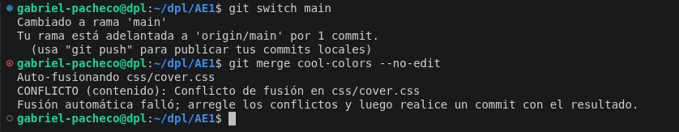

Se resolvió conservando el cambio entrante de `user2`: `color: darkgreen;`.

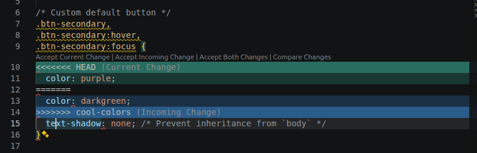

Finalmente se añadió la sombra al botón y se cerró la issue con la referencia correspondiente en el commit.

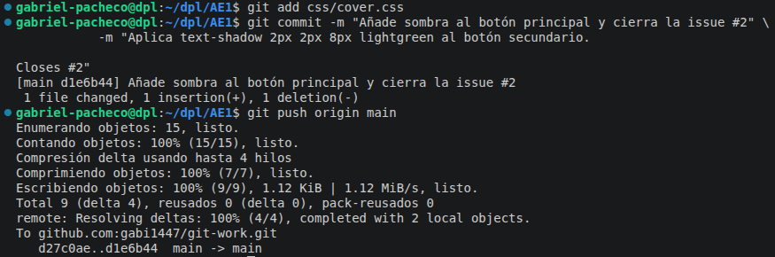

### Etiqueta y release

La versión final se etiquetó de forma anotada como `0.1.0`, se comprobó su contenido y se publicó su *release* en GitHub.

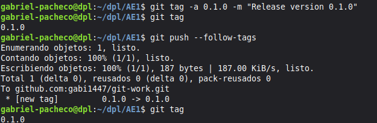

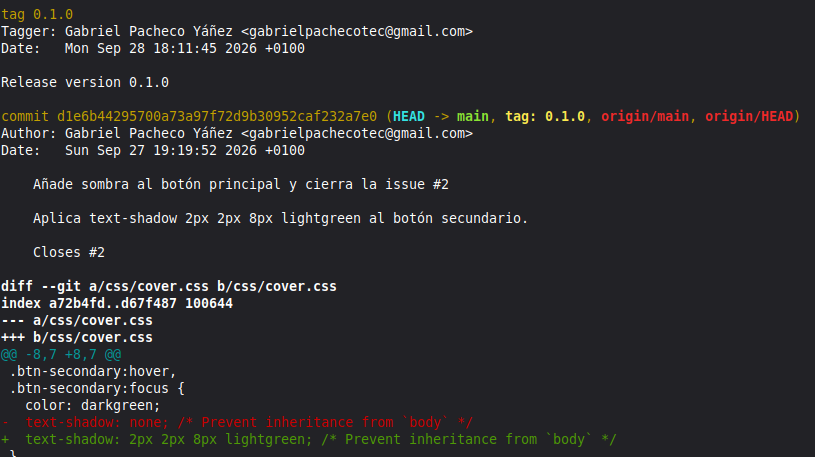

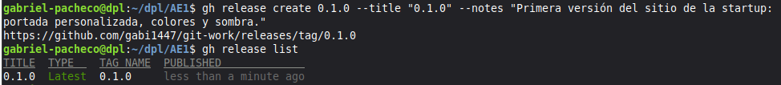

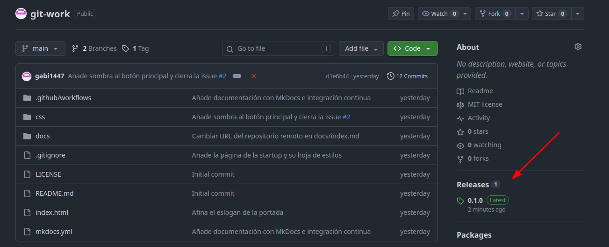

## Configuración

La portada está en `index.html` y sus estilos en `css/cover.css`. Las dos líneas modificadas durante la práctica fueron las del botón secundario:

```css
color: darkgreen;
text-shadow: 2px 2px 8px lightgreen;
```

También se incorporó documentación con MkDocs y un workflow de GitHub Actions en `.github/workflows/ci.yml`. Este ejecuta `mkdocs build --strict` en cada `push` a `main` y en cada *pull request*.

## Comprobación

Las salidas reales de `git log`, remotos, etiquetas y autoría están recogidas en [comprobaciones.txt](comprobaciones.txt). La evidencia confirma:

- Dos ramas de trabajo: `custom-text` y `cool-colors`.
- Primer PR fusionado y segundo PR cerrado tras resolver localmente el conflicto.
- Conflicto en `css/cover.css` resuelto manteniendo `darkgreen`.
- Etiqueta anotada `0.1.0` y su *release*.
- Uso de `origin` y `espejo` como equivalencia individual de repositorio principal y *fork*.

## Problemas encontrados y solución

| Problema | Causa | Actuación realizada o propuesta |
| --- | --- | --- |
| No se pudo hacer *fork* del repositorio. | GitHub no permite crear un *fork* de un repositorio perteneciente a la misma cuenta. | Se creó `git-work-espejo` y se trabajó desde `AE1-user2`. Las ramas se enviaron al espejo y a `AE1` para crear los PR, que equivale al flujo desde un *fork*. |
| No se pudo aprobar el propio PR. | GitHub impide que la misma cuenta apruebe su propio *pull request*. | Se documentó la conversación y la revisión con comentarios y commits de ambos papeles locales; después se realizó la fusión. |
| Conflicto en `css/cover.css`. | Las ramas modificaron la misma línea del color del botón: `purple` en `main` local y `darkgreen` en `cool-colors`. | Se resolvió manualmente el conflicto, se eliminaron las marcas de Git y se conservó `darkgreen`, tal como pide el enunciado. |
| El pipeline de documentación falla. | `docs/index.md` enlaza a `../index.html`, que está fuera de `docs/`. Con `mkdocs build --strict`, MkDocs considera inválida esa referencia. | Incidencia pendiente de corregir: mover o copiar la portada al árbol `docs/` y enlazarla desde ahí, o eliminar/sustituir ese enlace por una página publicada válida. |

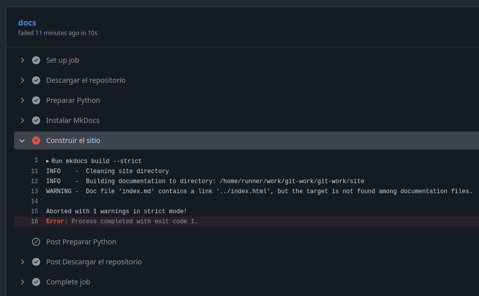

## Repositorio remoto

Repositorio principal: <https://github.com/gabi1447/git-work>

Repositorio espejo usado para simular el *fork*: <https://github.com/gabi1447/git-work-espejo>
